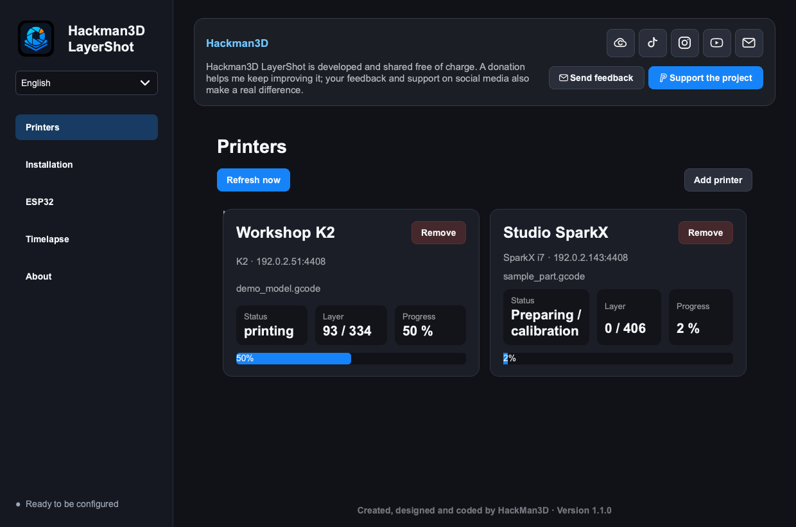
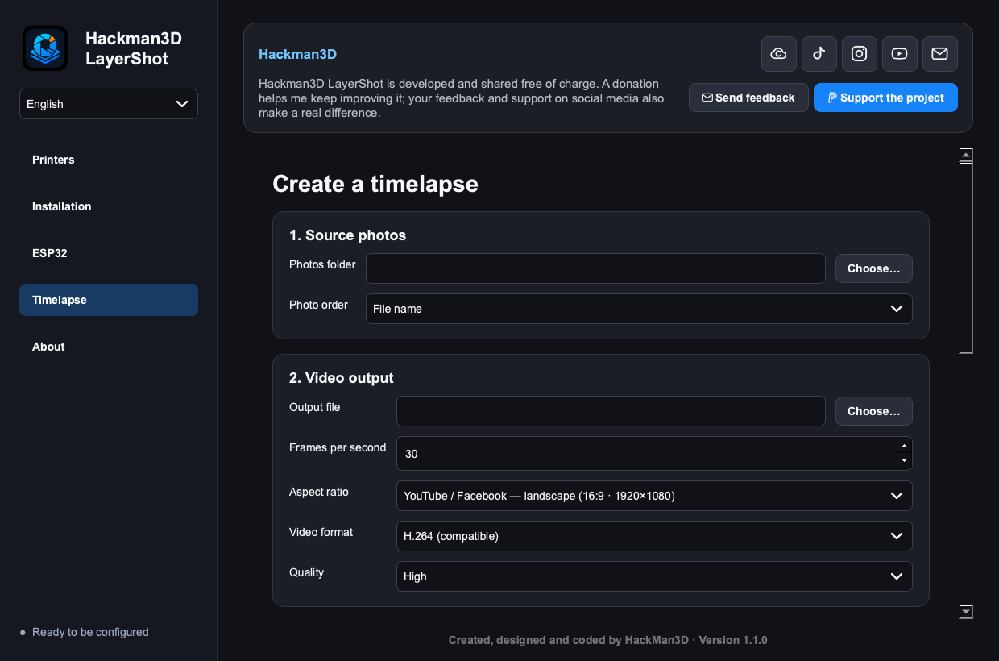

# Hackman3D LayerShot

Hackman3D LayerShot turns a small ESP32-C3 into an autonomous Bluetooth camera
shutter for 3D-printing timelapses. It detects layer changes through Moonraker
and asks the native iPhone Camera app to take one photo per layer.

No iPhone application is required. Once the ESP32 has been configured, the Mac
or PC application can be closed during the entire print.



## Download — version 0.5.2

No compilation or Arduino IDE setup is required:

- [Download for macOS — Apple Silicon](https://github.com/HackMan3D/Hackman3D-LayerShot/releases/download/v0.5.2/Hackman3D-LayerShot-macOS-0.5.2.zip)
- [Download the Windows installer — 32-bit and 64-bit](https://github.com/HackMan3D/Hackman3D-LayerShot/releases/download/v0.5.2/Hackman3D-LayerShot-Windows-Setup-0.5.2.exe)
- [Standalone ESP32-C3 firmware 1.7.0](https://github.com/HackMan3D/Hackman3D-LayerShot/releases/download/v0.5.2/Hackman3D-LayerShot-ESP32-C3-Firmware-1.7.0.bin)

The desktop application already contains the firmware and installs it from the
**Installation** page. The standalone firmware file is provided only for
recovery and advanced use.

## Three steps. That is all.

LayerShot is designed to be extremely simple:

1. **Install the LayerShot application** on the Mac or PC.
2. **Select the printer and the 2.4 GHz Wi-Fi network** in the guided
   Installation page.
3. **Connect the ESP32-C3 and click Install firmware.**

LayerShot installs the ESP32 program, sends all settings and restarts the board
automatically. There is no source code to edit, no Arduino IDE to install and no
firmware file to select. Pair the iPhone once, open its Camera app and LayerShot
is ready to photograph every layer.

## What LayerShot does

- controls the iPhone Camera shutter through Bluetooth HID (`Volume +`);
- detects layer changes autonomously through the printer's Moonraker API;
- supports multiple printers in separate dashboard cards;
- discovers compatible Klipper/Moonraker printers on the local network;
- identifies common Creality models when the printer exposes enough data;
- displays print state, progress, current layer and total layer count;
- embeds the printer camera preview when its local camera page is available;
- installs and configures the ESP32-C3 firmware in one guided operation;
- retrieves a known Wi-Fi password only after operating-system permission;
- provides an ESP status page and a local dashboard served by the ESP32;
- creates a video from imported photos with frame-rate, aspect-ratio, framing,
  rotation, quality and codec controls;
- uses the same Qt interface, features, translations and version number on
  macOS plus 32-bit and 64-bit Windows.

## Supported printers

LayerShot is designed for Creality printers exposing Moonraker/Klipper on the
local network, including:

| Family | Models |
|---|---|
| K2 | K2, K2 Plus |
| K1 | K1, K1C, K1 Max |
| Ender-3 V3 | Ender-3 V3, V3 KE, V3 SE, V3 Plus |
| Creality Hi | Hi, Hi Combo |
| SparkX | SparkX i7 |

Other Moonraker/Klipper printers can be added with the generic profile. Exact
camera and layer-count availability depends on the API exposed by the printer.

## Requirements

- an ESP32-C3 board with 4 MB flash;
- an iPhone compatible with Bluetooth camera remotes;
- a 2.4 GHz Wi-Fi network;
- a printer exposing Moonraker on the same local network;
- macOS 14 or later on Apple Silicon, or Windows 10/11 (32-bit or 64-bit).

## Installation

1. Download and open Hackman3D LayerShot.
2. Open **Installation**.
3. Discover or add the printer, test its connection, then save it.
4. Select the 2.4 GHz Wi-Fi network and enter its password. LayerShot can ask
   macOS or Windows for a password already known by that computer.
5. Connect the ESP32-C3 with a USB data cable and select its serial port.
6. Choose **Install firmware**. LayerShot validates the required information,
   flashes firmware 1.7.0 and sends the Wi-Fi and printer settings over USB.
7. Wait for the ESP LED to show that it is connected.

Wi-Fi credentials are never embedded in the application or downloadable
firmware. They are written only to the configured ESP32 and, when explicitly
retrieved or saved, to the current user's protected operating-system keychain.

## Pair the iPhone

1. On the iPhone, open **Settings > Bluetooth**.
2. In LayerShot, choose **Enable iPhone pairing**, or hold the ESP32 **BOOT**
   button for three seconds.
3. Select **Hackman3D LayerShot** on the iPhone.
4. Open the native Camera app and use **Test camera shutter**.
5. Keep the iPhone Camera app open and start the print.

The **BOOT** button has three actions:

| Action | Result |
|---|---|
| Short press | Take a photo |
| Hold for 3 seconds | Enable Bluetooth pairing for 60 seconds |
| Hold for 10 seconds | Erase saved Bluetooth pairing |

When removing a pairing, also choose **Forget This Device** in the iPhone's
Bluetooth settings before pairing again.

## LED colours

| Colour | Meaning |
|---|---|
| Red | Powered, but the iPhone is not connected |
| Flashing blue | Bluetooth pairing mode |
| Green | iPhone connected |
| Purple flash | Camera shutter command sent |

## Autonomous operation

The ESP32 directly monitors the configured printer. The desktop application and
computer do not need to remain open while printing. The ESP32 web dashboard is
available at:

`http://hackman-layershot.local`

Some routers publish a numbered `.lan` address instead. The desktop application
automatically searches for the LayerShot device and remembers the working local
address.

## Create a timelapse

1. Import the folder containing the iPhone photos.
2. Choose the output MP4 file.
3. Select frame rate, aspect ratio, framing, crop position, rotation, background,
   quality and H.264/H.265 codec.
4. Start the video export.

Video export currently requires FFmpeg to be installed and should be considered
a beta feature until it has been validated on a wider range of photo sets.



## Supported languages

The same language selector is included on macOS and Windows:

| | | |
|---|---|---|
| English | Français | Italiano |
| Español | Português | 中文 |
| Deutsch | हिन्दी | العربية |
| বাংলা | Bahasa Indonesia | Русский |
| 日本語 | 한국어 | Türkçe |
| Tiếng Việt | ไทย | |

English and French are currently fully translated. Other languages use English
text where a translation is not yet available.

## Troubleshooting

### macOS blocks the first launch

The current macOS build is signed for integrity but is not yet notarized through
the Apple Developer programme. Control-click **Hackman3D LayerShot**, choose
**Open**, then confirm **Open** once. Later launches work normally.

### The ESP32 cannot connect to Wi-Fi

- use a 2.4 GHz network; ESP32-C3 does not connect to 5 GHz-only networks;
- check the password with the eye button before installation;
- place the ESP32 near the router for the first connection;
- reopen the ESP dashboard or use the ESP status page in LayerShot.

### The iPhone is connected but no photo is taken

- keep the native iPhone Camera app visible;
- test a short **BOOT** press first;
- remove the pairing on both the ESP32 and iPhone, then pair again;
- verify that the ESP LED is green before testing the shutter.

### The printer is not found

- confirm that the computer and printer are on the same local network;
- use network discovery from the Installation page;
- try the Moonraker ports `4408`, `7125` and `80`;
- verify that the printer's local web interface is reachable in a browser.

## Build from source

End users should use the ready-to-run downloads above. Contributors need Python
3.11 or later.

### macOS

```sh
./build_macos.sh
```

### Windows 32-bit and 64-bit

```powershell
.\build_windows.ps1
```

Both scripts package the shared files under `src/hackman_layershot` and produce
application version 0.5.2. The Windows script requires Python 3.12 x64,
Python 3.10 x86 and Inno Setup 7. It produces one installer that automatically
selects the correct architecture; end users do not need Python or Inno Setup.

## Firmware source

The Arduino source is in `firmware/Hackman3DLayerShot`. It targets an ESP32-C3
with 4 MB flash and the **Huge APP** partition scheme. The desktop app embeds the
ready-to-flash firmware image.

## Third-party components

The Windows x64 application uses
[Espressif esptool 5.3.1](https://github.com/espressif/esptool/tree/v5.3.1);
the x86 compatibility application embeds the Python implementation of esptool
4.8.1. The GPL licence is included in
`src/hackman_layershot/assets/esptool-LICENSE.txt`. The Windows x86 interface
uses the last official LGPL PySide2 release supporting 32-bit Windows, while
the other builds use PySide6. The main Python and Qt dependencies are listed in
`pyproject.toml` and `build_windows.ps1`.

## Support

LayerShot is provided free of charge. Donations, feedback and follows on
HackMan3D social channels are welcome through the permanent application header.

Created, designed and coded by HackMan3D.

This repository is currently private. No redistribution license is granted until
a `LICENSE` file is added.
